# 📝 To-Do App

A simple and efficient To-Do application built using **Flutter**, focused on productivity and clean design.

---

## ✨ Description

This To-Do app is designed to help users manage their daily tasks with ease and clarity. With a modern and intuitive UI, users can quickly add, categorize, and track tasks while staying organized and productive — even offline. Users can also set reminders and visualize weekly/monthly task completion and pending tasks using pie and bar charts.

---

## 🔑 Key Features

- 🧑‍🎨 **Clean and Intuitive UI**  
  Built using Flutter to ensure a smooth user experience for adding, editing, deleting, and categorizing tasks.

- 🗃️ **Persistent Storage with SQLite**  
  Integrated a local SQLite database to store task data securely and allow offline-first access across sessions.

- 🔔 **Task Reminders with Local Notifications**  
  Utilized Flutter Local Notifications to alert users about scheduled tasks and daily goals.

- 📅 **Smart Task Management**  
  Users can:
  - Set due dates and times
  - Mark tasks as complete
  - Filter tasks by status or priority

- 📊 **Productivity Analytics**  
  Added chart visualizations to display:
  - Task completion rates
  - Daily/weekly productivity
  - Distribution by category

---

## 📊 Productivity Insights
### 🥧 Task Completion Distribution (Pie Chart)

<p align="center">
  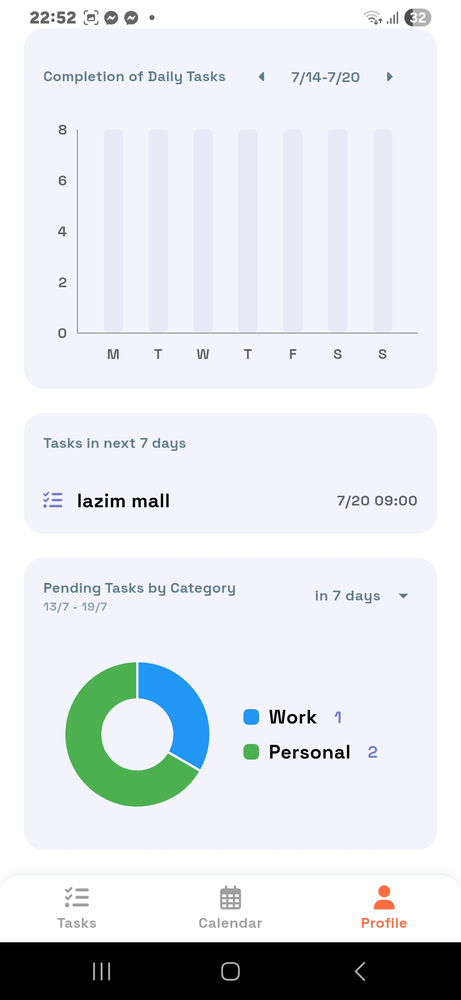
</p>

> *Shows how tasks are distributed across categories like Work, Personal, and Study.*

---
### 📅 Daily Productivity Overview (Bar Chart)

<p align="center">
  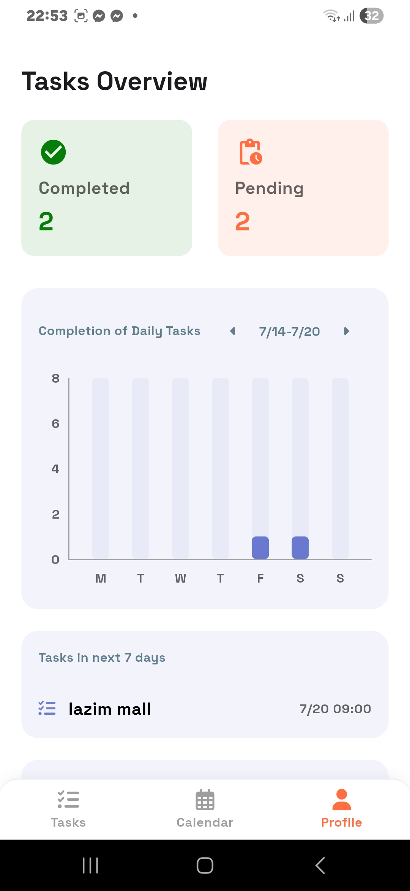
</p>

> *Displays how many tasks are completed on different days of the week.*

---

## 📸 App Screenshots

### 🏠 Landing Page

<p align="center">
  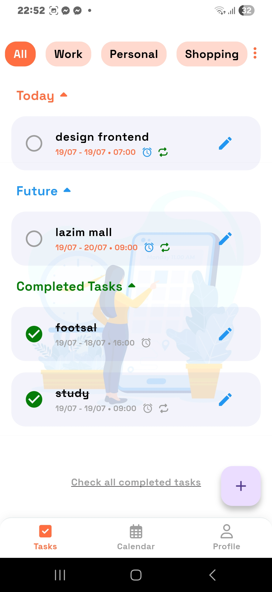
  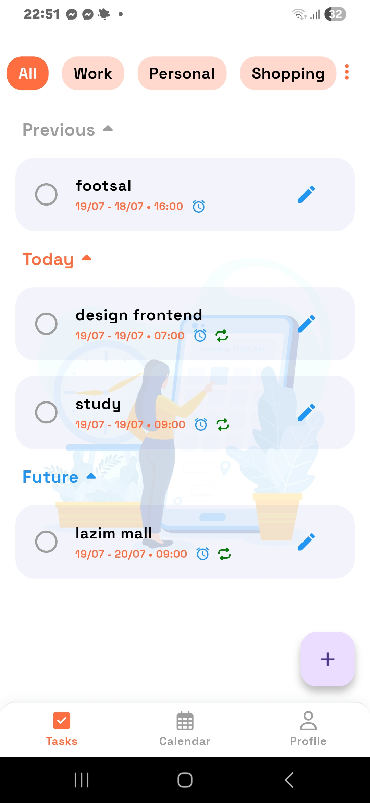
</p>

---
### ➕ Add Tasks Page

<p align="center">
  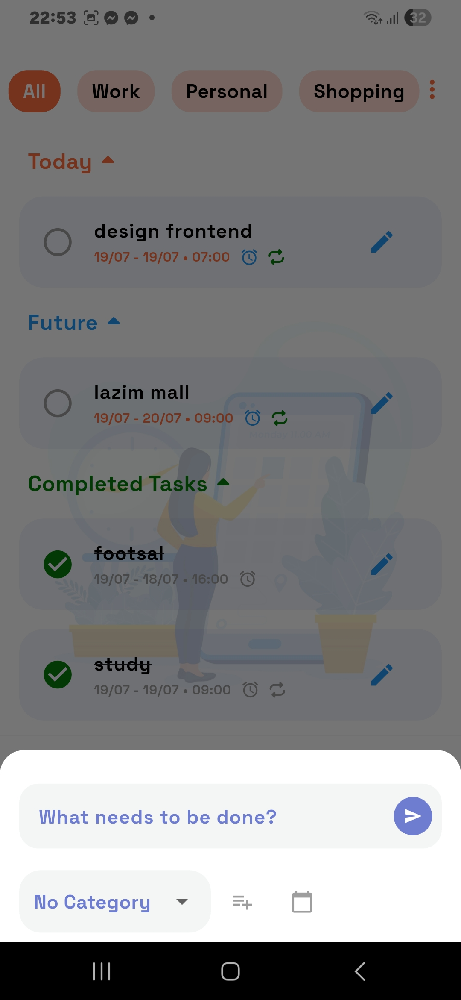
</p>

---

### 📝 Edit Tasks Page

<p align="center">
  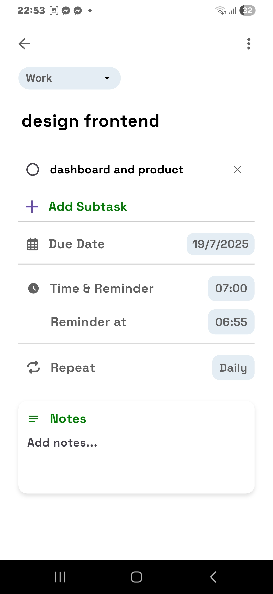
</p>

---

### 📆 Calendar View – Select Dates & Time

<p align="center">
  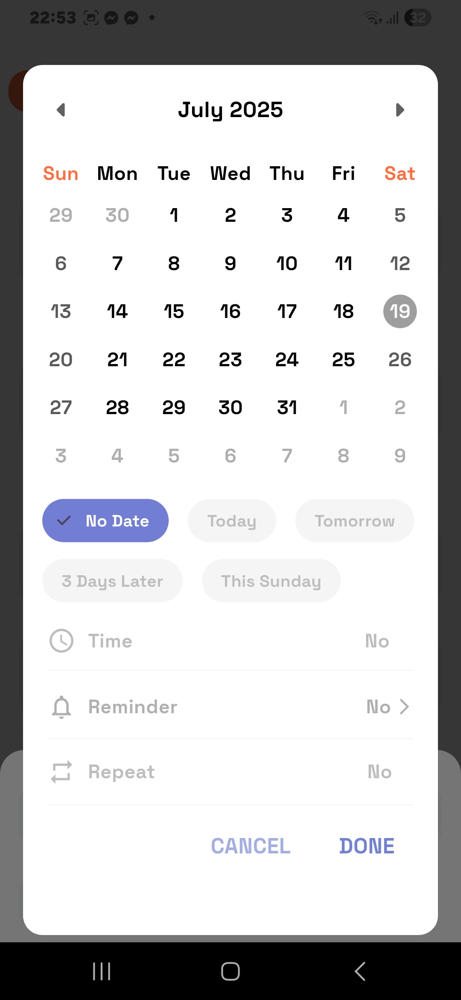
</p>

---

### 📋 Tasks on Selected Date

<p align="center">
  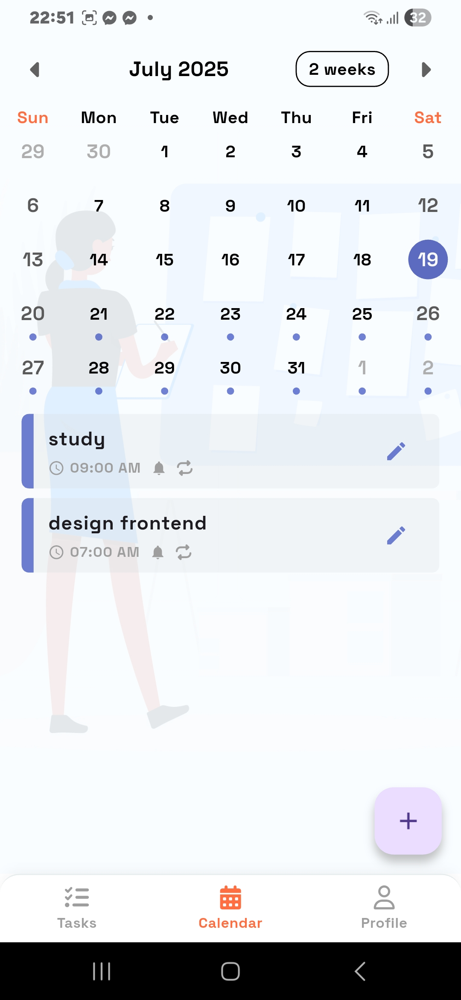
  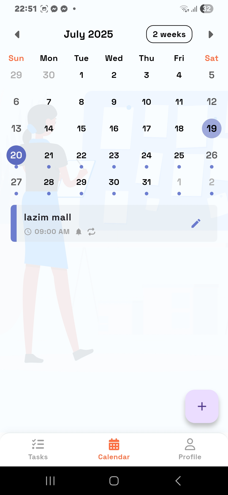
  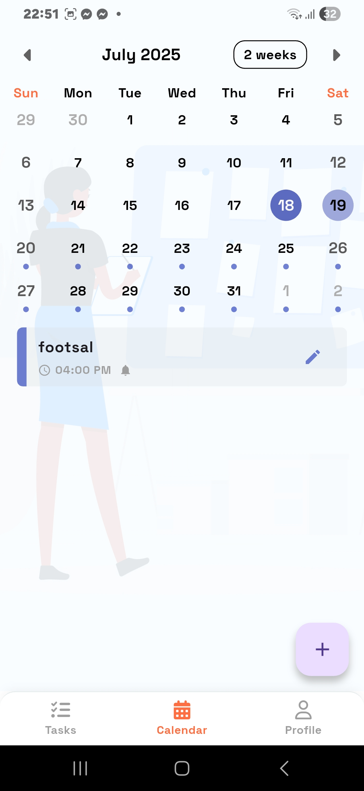
</p>

---
### ✅ Completed Tasks Overview

<p align="center">
  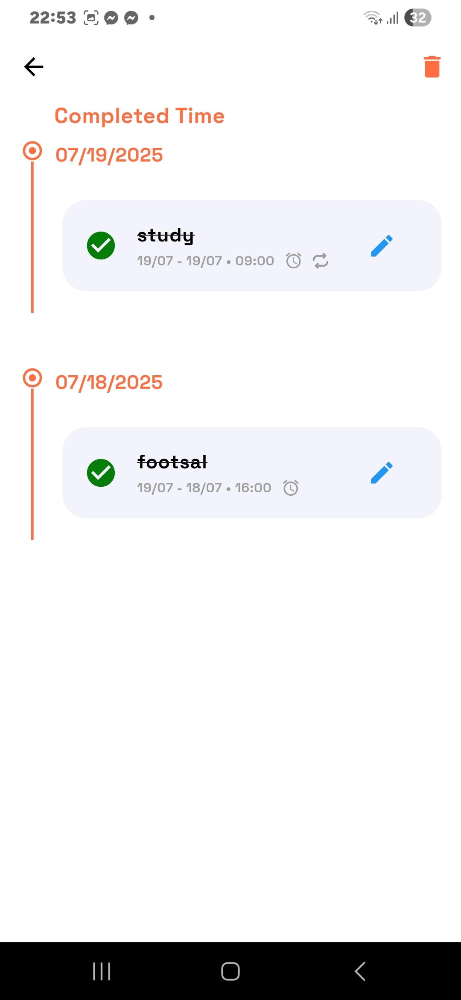
</p>

---

## 🚀 Quick Features Summary

- ✅ Add new tasks
- ✏️ Edit existing tasks
- 🗑️ Delete tasks
- 📂 Mark tasks as complete/incomplete
- 💾 Data persistence with SQLite (offline-first)
- 🔔 Local notifications for reminders
- 📅 Due date and priority filtering
- 📊 Visualize productivity with charts
- 🎨 Clean and responsive UI using Flutter

---

## 🛠️ Built With

- **Flutter** (Frontend)
- **Dart** (Language)
- **SQLite** (Local Database)
- **Firebase / Google API** (Push Notifications)
- **Supabase** (Optional backend services)

---

## 🔧 Installation

```bash
# Clone the repository
git clone https://github.com/your-username/todo-app.git

# Navigate into the project folder
cd todo-app

# Install dependencies
flutter pub get

# Run the app
flutter run


---

## 📬 Contact

For feedback or questions, reach out via:

- 💼 [LinkedIn](https://www.linkedin.com/in/swen-shrestha-a89041304/)
- 📧 [Gmail](shresthaswen80@gmail.com)

---

## ⭐️ Show Your Support

If you like this project, please ⭐️ it and share it with your friends!

---
gi